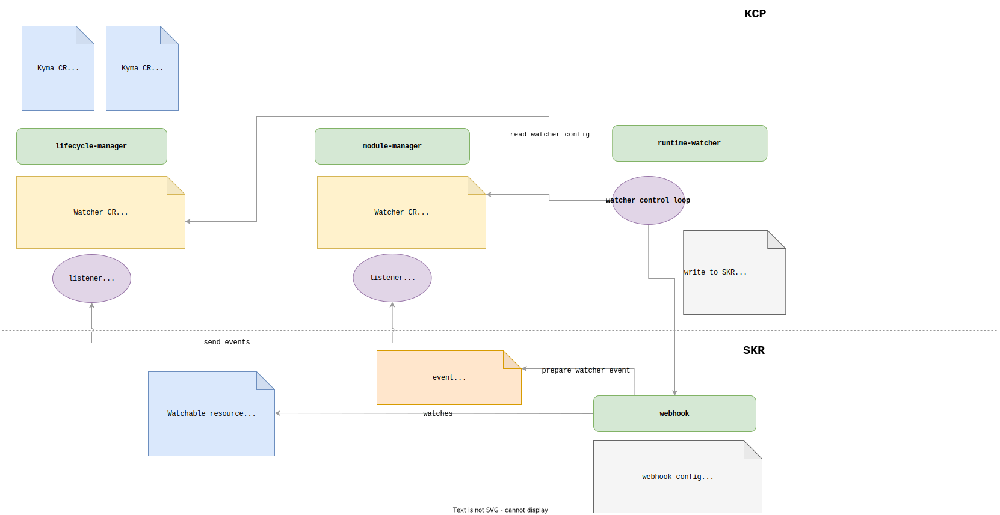

# Runtime-Watcher (PoC)

> Modify the title and insert the name of your project. Use Heading 1 (H1).

## Overview

Kyma is the opinionated set of Kubernetes based modular building blocks that includes the necessary capabilities to develop and run enterprise-grade cloud-native applications. This repository is the PoC (proof of Concept) for the `Kyma Watcher`. The Watcher is an operator watching for events (`ADDED`, `DELETED`, `MODIFIED`) of configured GVRs (Group Version Resources)inside a Kyma-Cluster in specific namespaces. The observed events will then be processed and communicated to the KCP (Kyma-Control-Plane).

The **skr-watcher** implementation is in the [skr directory](./skr).

The **listener** package implements a listener endpoint which triggers a reconciliation for the received events. This package is used by the different operators in the KCP which are responsible for the lifecycle managemnt of a Kyma runtime.

The **kcp-watcher** implementation is in the [kcp directory](./kcp).

![]

